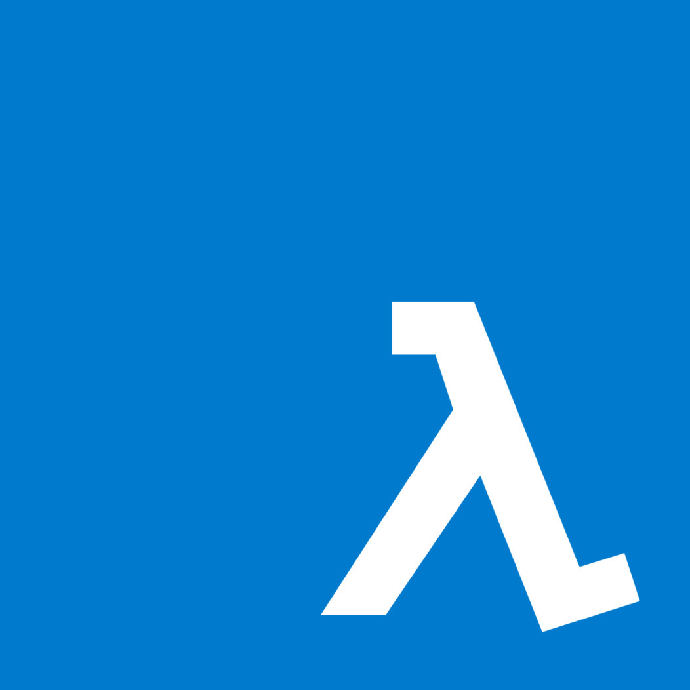

<p align="center">
    
</p>

# Functional Programming in TypeScript Workshop

[](https://github.com/kutyel/fp-typescript-workshop/actions/workflows/main.yml)

⚡️ Let's learn some functional programming together!

We will be using the amazing [Effect.ts](https://effect.website/) library (v4) because it is designed from the ground up to work nicely with TypeScript! 😎

## Requirements

Install [Bun](https://bun.sh/docs/installation)!

> This project uses Bun instead of Node as an experiment and to make things crazy fast! 🚄

If you are using homebrew:

```sh
$ brew tap oven-sh/bun # for macOS and Linux
$ brew install bun
```

## Run the tests and solve the exercises!

There are 3 rounds of exercises: `functors`, `applicatives` and `monads`.

The exercises live in `src/` and are stubbed out with a `TODO()` placeholder. Their corresponding tests in `tests/` are marked as `test.todo`, so they are skipped by default. To solve an exercise:

1. Change `test.todo(` back to `test(` in the spec file to enable the test.
2. Replace the `TODO()` placeholder in `src/` with your implementation until the test goes green! ✅

My recommendation is that you run only the specific test file in watch mode and solve the exercises in that order before moving to the next challenge. 😉

```sh
$ bun test --watch functors
$ bun test --watch applicatives
$ bun test --watch monads
```

## Solutions

Stuck? The complete solutions are available on the [`solutions`](https://github.com/kutyel/fp-typescript-workshop/tree/solutions) branch. But give it an honest try first! 🙈

Happy coding! ⚡️
